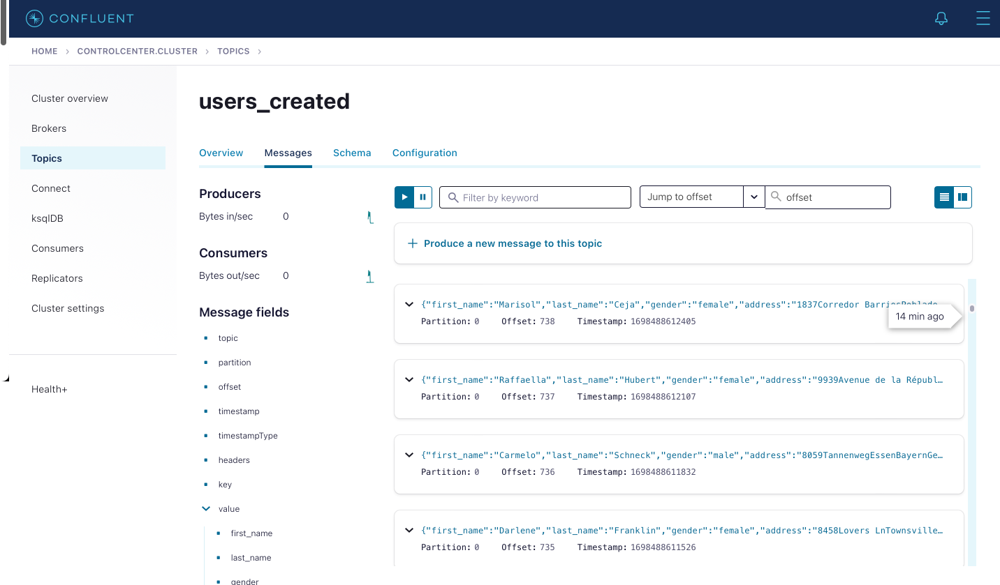

### DATA-ENGINEERING-PROJECT:

**Project Description**
<p>In the ever-evolving world of data-driven decision-making,
this project is a testament to a seamless, end-to-end 
data engineering pipeline that encompasses data generation,
ingestion, processing, and storage. This project represents 
a meticulously crafted system, underpinned by a robust tech stack 
and meticulous design choices, to provide a holistic solution to 
data engineering challenges.</p>

## Table of Contents

- [Architecture](#Architecture)
- [Installation](#Installation)
- [Technologies and Tools](#Technologies-and-Tools)


## <ins> Architecture : </ins>

### <ins>CONTROL-CENTER :</ins>

## <ins>Installation :</ins>
```bash
$ git clone https://github.com/AnasNedday/Data-Engineering-Project.git
$ cd Data-Engineering-Project
$ docker-compose up
```
## <ins>Technologies and Tools :</ins>
- **Python** 
- **Apache Airflow** 
- **Apache Kafka** 
- **Apache Spark** 
- **Apache Cassandra** 
- **Apache ZooKeeper**
- **PostgreSQL**
- **Docker** 
<p>

</p>
<div >
    <p>
        
        
        
                
        
        
        
        
    </p>
</div>


